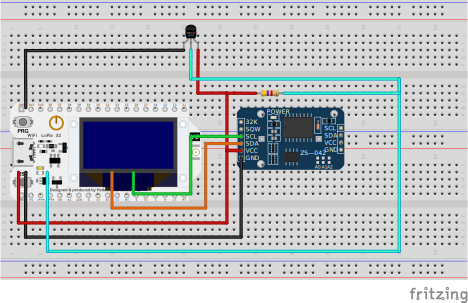

# Readme
## Project goals
* The current temperature would be transmitted via Notify to the subscriber.
* We like to switch an output of the ESP32 on/off
* We like to have a ring buffer to store temperature values on the ESP32
* We have a real-time clock connected to the ESP32 to have DateTime points for each temperature measurement
* We need to set the current DateTime & Timezone from a Master / Central (Smarthpone)
* We need to have a characteristic where we can set the timeframe we are interestet to download (historic data)
* We need a characteristic to get the data, that is inbetween this setted timeframe
* We need a characteristic to set and get temperature measurement interval

## ESP32 Datasheet

Here the Datasheet:
[Datasheet ESP32](./../assets/esp32_datasheet_en.pdf)

## Dallas Temperature Sensor 18B20

Here the Datasheet:
[Datasheet 18B20](./../assets/ds18B20.pdf)

## ESP32 Pinout


## Libs

Install Libs:

```
arduino-cli.exe lib install "OneWire"
arduino-cli.exe lib install "DallasTemperature"
arduino-cli lib install "RTClib"
arduino-cli lib install "CircularBuffer"
```

## Circut



## BLE Lib Source Code

https://github.com/arduino-libraries/ArduinoBLE

## BLE Terminology

* **Master** (or "**central**") devices scan for other devices. Usually, the master is the smartphone/tablet/PC.

* **Slave** (or "**peripheral**") devices advertise and wait for connections. Usually, the slave is the BLE112/BLE113 module.

* **Client** devices access remote resources over a BLE link using the GATT protocol. Usually, the master is also the client.

* **Server** devices have a local database and access control methods, and provide resources to the remote client. Usually, the slave is also the server.

* You can use **read**, **write**, **notify**, or **indicate** operations to move data between the client and the server.

  * **Read** and **write** operations are requested by the client and the server responds (or acknowledges).
  * **Notify** and **indicate** operations are enabled by the client but initiated by the server, providing a way to **push data to the client**.
  * **Notifications** are **un**acknowledged, while **indications** are acknowledged. Notifications are therefore faster, but less reliable

  

## BLE Master vs. Slave - Connection Roles

One important concept in BLE connectivity is the difference between a **master** device and a **slave** device. What do each of these terms imply? First, realize that they are *not* interchangeable with client/server, which will be explained below. Actually, in the BLE world, the master/slave difference is very easy to define and recognize:

- **Master / Central** - the BLE device which initiates an outgoing connection request to an advertising peripheral device

- **Slave / Peripheral** - the BLE device which accepts an incoming connection request after advertising

These pairs of terms are the only ones in the list above which are actually interchangeable. References to a "master" or "central" device are describing the same thing, and references to a "slave" or "peripheral" device are also each describing the same thing. In the **[CoreBluetooth APIs](http://developer.apple.com/library/ios/#documentation/CoreBluetooth/Reference/CoreBluetooth_Framework/_index.html)** provided by Apple for iOS development, the "Central" and "Peripheral" nomenclature is used; you will not generally see references to master or slave devices in this context.

One important distinction between the master and slave device in a BLE network is that **a slave may only be connected to a single master, but a master may be connected to multiple slaves**. The BLE specification does not limit the number of slaves a master may connect to, but there is always a practical limitation, especially on small embedded modules. Our v1.1 BLE stack can support up to **8** **simultaneous connections** as a master device, when properly configured.

The connection role--whether a device is a master or slave--is defined the moment the connection is made. Our stack is capable of acting either as a master or as a slave device. If a device is operating as a slave, it needs to advertise (accomplished in our BLE stack with the **gap_set_mode** command); if it is operating as a master, it will optionally scan for devices (accomplished in our stack with **gap_discover**) and initiate a connection request to another device (accomplished in our stack with **gap_connect_direct**).


## Client vs. Server - GATT Functionality

Another important concept in a BLE design is the difference between a **GATT server** and a **GATT client**. These roles are not mutually exclusive, though typically your device will only be one or the other. Which role(s) your device takes depends on how you need it to work. Here is a basic summary of each kind of functionality:

- **GATT client** - a device which accesses data on the remote GATT server via read, write, notify, or indicate operations

- **GATT server** - a device which stores data locally and provides data access methods to a remote GATT client

Unlike the master/slave distinction defined previously, it is easy to see that one device might actually be both of these things at the same time, based on how your application defines the data structure and flow for each side of the connection. While it is most common for the slave (peripheral) device to be the GATT server and the master (center) device to be the GATT client, this is not required. **The GATT functionality of a device is logically separate from the master/slave role.** The master/slave roles control how the BLE radio connection is managed, and the client/server roles are dictated by the storage and flow of data.


From https://community.silabs.com/s/article/ble-master-slave-gatt-client-server-and-data-rx-tx-basics?language=en_US

## ESP32 BLE

* Profile: standard collection of services for a specific use case;
* Service: collection of related information, like sensor readings, battery level, heart rate, etc. ;
* Characteristic: it is where the actual data is saved on the hierarchy (value);
* Descriptor: metadata about the data;
* Properties: describes how the characteristic value can be interacted with. For example: read, write, notify, broadcast, indicate, etc.

See also: https://randomnerdtutorials.com/esp32-bluetooth-low-energy-ble-arduino-ide/

## Bluetooth Assigned Numbers Documentation

Here the PDF [Assigned Numbers](./../assets/Assigned_Numbers.pdf)
