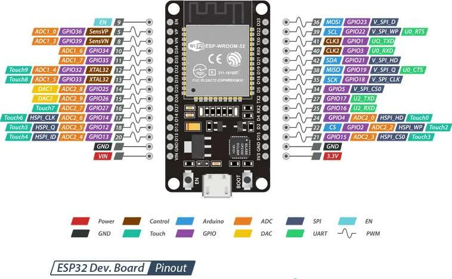

# ESP32 Datasheet

Here the Datasheet:
[Datasheet ESP32](./../assets/esp32_datasheet_en.pdf)


# ESP32 Pinout



# Tutorial

[Tutorial](https://wolles-elektronikkiste.de/ds3231-echtzeituhr)

# Libs

```
arduino-cli lib install RTClib
```